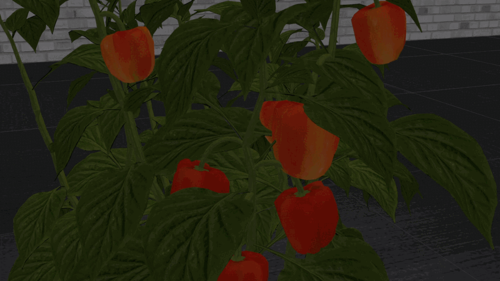

# Capsicum Superellipsoid Detector (ROS1)

Autonomous crop monitoring is a difficult task due to the complex structure of plants. Occlusions from leaves can make it impossible to obtain complete views of all fruits of plants (e.g. Capsicum). Therefore, accurately estimating the shape and volume of fruits from partial information is crucial to enable further advanced automation tasks such as yield estimation and automated fruit picking. In this work, we present an approach for faster and better estimating the shapes of fruits by fitting superellipsoids.

This ROS package; 

1. Applies Euclidean Clustering to the input point cloud,

2. Computes surface normals to estimate fruit centers with the least-squares intersection of lines approach,

3. Fits superellipsoids to the clustered points with a non-linear least-squares approach.

4. Predicts missing surfaces on a fruit, which may be useful for planning.

Also, some prototypes and experiments (implemented in Python) can be found in the [prototypes](prototypes) folder.




## Paper and Video

Screen recording while running the project can be seen [here](https://www.youtube.com/watch?v=kX0oy-pKSh4).

If using our project for scientific publications, please cite our paper available [here](https://doi.org/10.1109/CASE49997.2022.9926466) and [here](https://doi.org/10.48550/arXiv.2203.15489):

S. Marangoz, T. Zaenker, R. Menon and M. Bennewitz, **"Fruit Mapping with Shape Completion for Autonomous Crop Monitoring,"** *2022 IEEE 18th International Conference on Automation Science and Engineering (CASE)*, 2022, pp. 471-476.

```
@INPROCEEDINGS{marangoz2022fruit,
  author={Marangoz, Salih and Zaenker, Tobias and Menon, Rohit and Bennewitz, Maren},
  booktitle={2022 IEEE 18th International Conference on Automation Science and Engineering (CASE)}, 
  title={Fruit Mapping with Shape Completion for Autonomous Crop Monitoring}, 
  year={2022},
  pages={471-476},
  doi={10.1109/CASE49997.2022.9926466}
}
```

TODO: TOC


## Installation

### Related Packages

Packages needed for running launch files. Try running `start_bag.launch` if you don't want to install these packages.

- **[voxblox](https://voxblox.readthedocs.io/en/latest/pages/Installation.html)** (3D mapping)

```
$ cd ~/catkin_ws/src
$ mkdir voxblox
$ cd voxblox
$ git clone git@github.com:ethz-asl/voxblox.git
$ wstool init . ./voxblox/voxblox_ssh.rosinstall
```

- [**ur_with_cam_gazebo**](https://github.com/Eruvae/ur_with_cam_gazebo) (simulator)
- [**roi_viewpoint_planner**](https://github.com/Eruvae/roi_viewpoint_planner) (robotic arm planner)
- [**pointcloud_roi**](https://github.com/Eruvae/pointcloud_roi) (alternative for agrobot_mrcnn_ros on simulation environment for mask extraction)
- agrobot_mrcnn_ros (deep learning model for detecting sweet peppers in camera images)

### Package Dependencies

Dependencies needed **only** for compiling and running the node (excluding launch files).

- Ubuntu 20.04 + ROS Noetic

- **[superellipsoid_msgs](https://github.com/salihmarangoz/superellipsoid_msgs)**
- **[octomap_vpp](https://github.com/Eruvae/octomap_vpp)**
  - Only used for publishing **`~superellipsoids_volume_octomap`**. 
  - Also, **[octomap_vpp_rviz_plugin](https://github.com/Eruvae/octomap_vpp_rviz_plugin)** may be useful for visualization.


- **[Ceres Solver](http://ceres-solver.org/installation.html):** (I have developed the project using the version 2.x.x but both versions should be OK.)

  ```bash
  $ sudo apt install libceres-dev
  ```
  
- Others: Octomap, PCL, etc. Defined in `package.xml`.

```bash
$ cd catkin_ws/
$ rosdep install --from-paths src --ignore-src -r # install missing dependencies
```

### Compile

```bash
$ cd catkin_ws/
$ catkin build --cmake-args -DCMAKE_BUILD_TYPE=Release
```

## Running

For **running** the node use the following command:

```bash
$ $ roslaunch capsicum_superellipsoid_detector start_bag.launch # for a quick demo
# OR
$ roslaunch capsicum_superellipsoid_detector start_sim.launch # for simulation
# OR
$ roslaunch capsicum_superellipsoid_detector start_real.launch # for real world
```

## ROS Topics, Transforms, and Services

### Parameters

- **`p_cost_type`** **: 2**

  The cost function for fitting superellipsoids to the input points. `RADIAL_EUCLIDIAN_DISTANCE` and `SOLINA` are recommended options.

  

  - `CostFunctionType::NAIVE = 0`: Uses the superellipsoid parametric representation directly.

  

  - `CostFunctionType::LEHNERT = 1`: Lehnert's implementation squares the parametric function value compared to Solina's method.

  

  - `CostFunctionType::RADIAL_EUCLIDIAN_DISTANCE = 2`: Works better with non-equilateral superellipsoids and estimates inside the shape better.

  

  - `CostFunctionType::SOLINA = 3`: Solina's distance approximation method with volume constraint. Estimates better for equilateral superellipsoids.

  

  - `CostFunctionType::SOLINA_DISTANCE = 4`: Solina's distance approximation method.

  

- **`p_prior_center`: 0.1**

  

  - The prior (alpha value in the formula) which enforcing optimized center **t** and center estimated via surface normals **p** to be close to each other. Higher values increases the regularization.

- **`p_prior_scaling`: 0.1**

  

  - The prior (beta value in the formula) which is enforcing **a**, **b**, **c** values define the scaling of superellipsoid to be close to each other. Higher values increase the regularization. Different than the volume constraint.

- **`p_missing_surfaces_num_samples`: 300**

  - The number of points being used to find points belonging to missing surfaces with rejection sampling.

- **`p_missing_surfaces_threshold`: 0.015**

  - In meters. Points sampled with the projected Fibonacci sphere method are compared to the input data points. If the distance is higher than the threshold, the point will be marked as a missing surface point.

- **`p_min_cluster_size`: 100**
  
  - Discards clusters smaller than this value.
  
- **`p_max_cluster_size`: 10000**

  - Discards clusters larger than this value.

- **`p_max_num_iterations`: 100**

  - The maximum number of optimization iterations.

- **`p_cluster_tolerance`: 0.01**

  - In meters. Groups two points with smaller distance than this value into the same cluster.

- **`p_estimate_normals_search_radius`: 0.015**

  - In meters. Search radius for surface normal estimation.

- **`p_estimate_cluster_center_regularization`: 2.5**

  - Regularization for the intersection of lines estimation. Defines a bias towards the mean of cluster points. Higher values bring the result towards the bias point. Useful when there are not enough surfaces.

- **`p_pointcloud_volume_resolution`: 0.001**

  - In meters. Resolution of the pointcloud in **~superellipsoids_volume** message.

- **`p_octree_volume_resolution`: 0.001**

  - In meters. Resolution of the pointcloud in **~superellipsoids_volume_octomap** message.

- **`p_print_ceres_summary`: false**

  - Enables printing cost, gradients, extra information, etc. for each optimization step.

- **`p_use_fibonacci_sphere_projection_sampling`: false**

  - If true, uses our approach for sampling of superellipsoid surfaces which distributes points on the surface uniformly. If false, uses the superellipsoid parametric representation which enables easier perceiving the orientation of the superellipsoids. This only affects the the output of **~superellipsoids_surface** message.

- **`p_world_frame`: "world"**

  - World transform frame.
  - TODO: will be used for object tracking

### Subscribed Topics

**`~pc_in`** ("sensor_msgs/PointCloud2")

- RGBXYZ pointcloud as the input (e.g. voxblox output can be used as the input). Currently RGB information is not used. Some modifications may be needed to feed XYZ only pointcloud.

### Published Topics

Note: Computation resources will only be used for subscribed topics.

- **`~superellipsoids`** ("superellipsoid_msgs/SuperellipsoidArray")
  - Optimized superellipsoids output. Headers are the same for all superellipsoids.
- **`~clusters`** ("sensor_msgs/PointCloud2")
  - RGBXYZ pointcloud with each cluster has a different RGB color. Colors may be changed between messages for the same clusters. Recommended only for debugging.
- **`~superellipsoids_surface`** ("sensor_msgs/PointCloud2")
  - XYZ pointcloud for the surface of superellipsoids.
- **`~centers_prior`** ("sensor_msgs/PointCloud2")
  - XYZ pointcloud for predicted centers via only using surface normals. Recommended only for debugging.
- **`~centers_optimized`** ("sensor_msgs/PointCloud2")
  - XYZ pointcloud for centers computed after the superellipsoid optimization. Centers for failed optimizations will not be published. Recommended only for debugging.
- **`~superellipsoids_volume`** ("sensor_msgs/PointCloud2")
  - XYZ pointcloud for the volume of superellipsoids. The volume is sampled uniform with a fixed resolution and then all points are transformed to the real position. 
- **`~superellipsoids_volume_octomap`** ("octomap_msgs::Octomap")
  - XYZ octomap_vpp::CountingOcTree for the volume of superellipsoids. The volume is sampled uniform with a fixed resolution and then all points are transformed to the real position. The count value represents cluster index of the superellipsoid.
- **`~surface_normals_marker`** ("visualization_msgs::MarkerArray")
  - Arrow markers for visualizing surface normals. Surface normals are computed w.r.t. predicted cluster center. Only recommended for debugging. Use `~xyz_label_normal` for further processing.
- **`~xyz_label_normal`** ("sensor_msgs/PointCloud2")
  - XYZLNormal pointcloud for all clustered points. Labels are indicating cluster indexes and normals are computed w.r.t. predicted cluster center. 
- **`~missing_surfaces`** ("sensor_msgs/PointCloud2")
  - XYZLNormal pointcloud representing (estimated) missing data points on an superellipsoid. Labels are indicating cluster indexes and normals are directed towards the optimized center. 

### Transforms

- `world` -> Input Pointcloud Frame

### Services

TODO

There are no services for the written node. But voxblox needs a `std_srvs/Empty` for publishing pointclouds of mapped plants which will be also triggering the computation of the superellipsoid detector node. Currently this task is assigned to `scripts/trigger_voxblox.py` which calls the related service in a fixed interval.


## Future Work

- Accessing to voxblox mesh (vertices and normas) directly would be better. This can take away the need to estimate normals. But this needs some workarounds and code modifications in voxblox.
- Better clustering / instance segmentation.
- 3D mapping with Instance segmentation. Mapping with masking pointcloud impacts the quality.
- Use of surface normals instead of a single estimated center in the optimization process. This may work better for non-sphere like capsicums.
- Sometimes capsicums may have weird shapes (not like a sphere nor superellipsoid, not symmetrical, etc.). Combination of multiple superellipsoids for modeling the fruit surface would be better. On the other hand, estimating the missing parts of the shape becomes difficult this way.
- Loss functions can be used against outliers: http://ceres-solver.org/nnls_modeling.html#lossfunction


## HiWi

This project is completed under a HiWi job at [Uni-Bonn Humanoid Robotics Lab](https://www.hrl.uni-bonn.de/). Meeting notes can be found [here](hiwi).


## TODO:

- [ ] simplify readme
- [ ] add object tracking
- [ ] optional dependencies as much as possible
- [ ] fix ros service, maybe add ros messages
- [ ] update the comments in superellipsoid msgs
- [ ] decrease the number of published topics if possible
- [ ] use tf2 instead of tf
