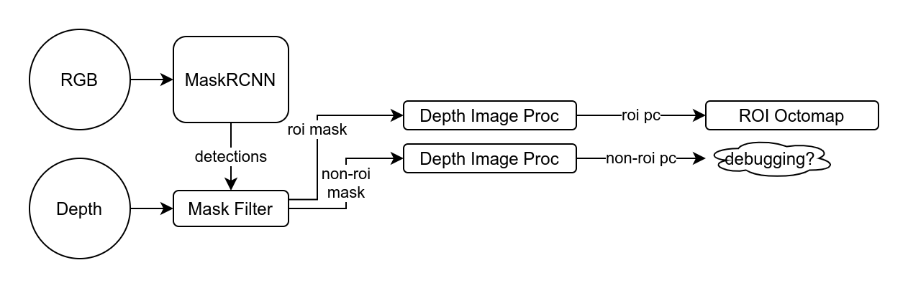
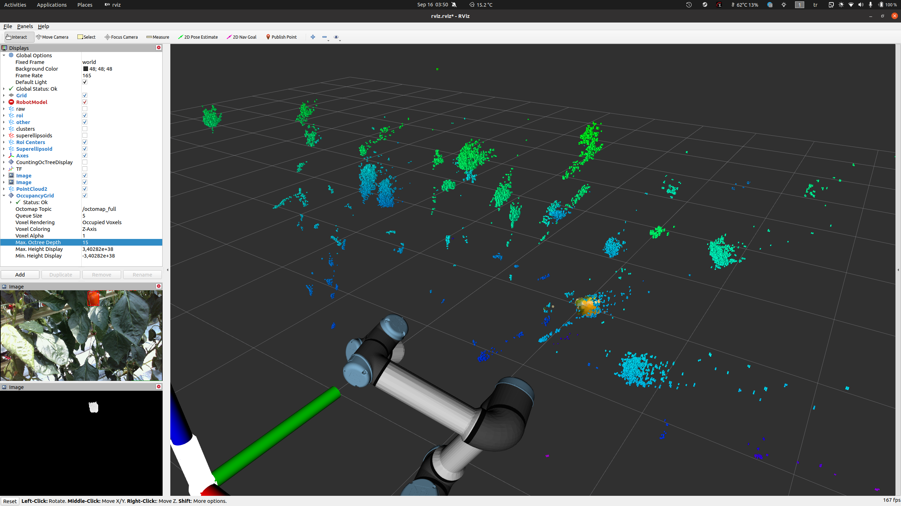
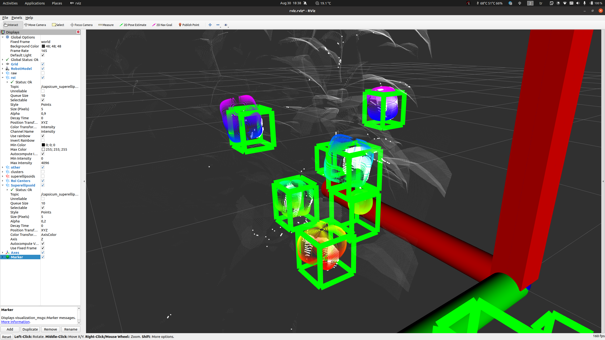
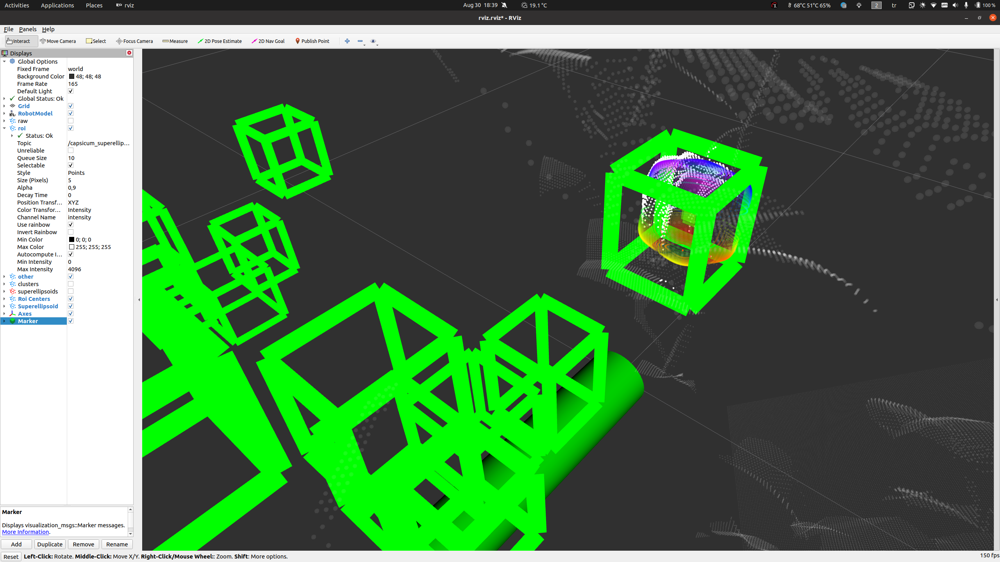
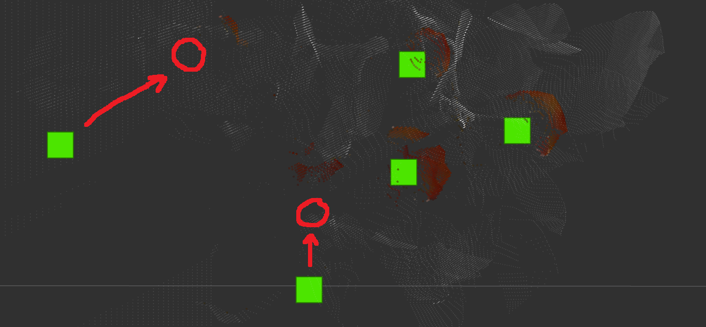
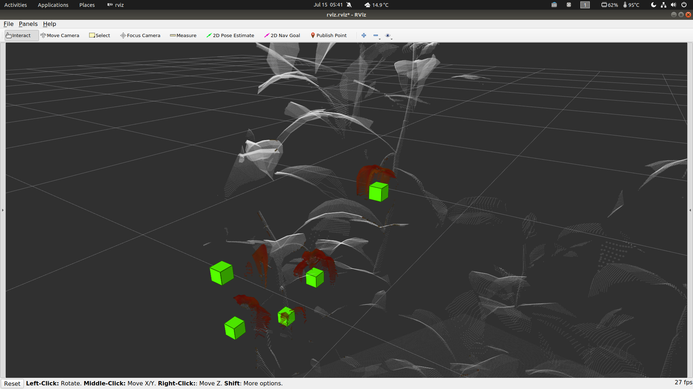

# capsicum_superellipsoid_detector

[toc]

**Salih Marangoz - s6samara@uni-bonn.de - salih285@gmail.com**

## Dependencies

```bash
$ cd $HOME
$ git clone https://github.com/PointCloudLibrary/pcl.git -b pcl-1.10.1
$ cd pcl; mkdir build; cd build
$ cmake -DCMAKE_BUILD_TYPE=Release .. -DBUILD_CUDA=1 -DBUILD_GPU=1 -DBUILD_cuda_io=1 -DBUILD_cuda_apps=1 -DBUILD_gpu_surface=1 -DBUILD_gpu_tracking=1 -DBUILD_gpu_people=1 -DBUILD_simulation=1 -DBUILD_apps=1 -DBUILD_examples=1 -DCUDA_ARCH_BIN=8.6 # Check values for CUDA_ARCH_BIN here: https://arnon.dk/matching-sm-architectures-arch-and-gencode-for-various-nvidia-cards/ For example; I have added 8.6 for my RTX3080. Not all of the modules here are needed but the total build size is not large when everything is compiled (~600MB).
$ make -j8
$ sudo make install  # "sudo make uninstall" is also possible. Don't delete the folder nor rename it

$ cd catkin_ws/src
$ git clone https://github.com/ceres-solver/ceres-solver.git
$ git clone https://github.com/ros-perception/perception_pcl.git -b melodic-devel

$ rosdep install --from-paths src --ignore-src -r # for other dependencis
```


## Compile & Run

- Ceres-solver build time can be improved via modifying `CMakeLists.txt`. Set these values `OFF`
  - `option(BUILD_TESTING "Enable tests" ON)`
  - `option(BUILD_EXAMPLES "Build examples" ON)`
  - `option(BUILD_BENCHMARKS "Build Ceres benchmarking suite" ON)`

```bash
$ cd catkin_ws/
$ catkin build --cmake-args -DCMAKE_BUILD_TYPE=Release
$ source catkin_ws/devel/setup.bash
$ roslaunch capsicum_superellipsoid_detector start.launch
```

### Test Kinfu (with GPU)


```bash
$ pcl/build/bin/pcl_kinfu_app -pcd pcl/test/grabber_sequences/pcd
# Press T on "View3D from ray tracing" window and press P on "Scene Cloud Viewer" window
# Also check nvidia-smi
```


## Debugging


There are two lines in `CMakeLists.txt` which enable AddressSanitizer and add debug symbols. For detecting heap corruptions, stack overflow, etc this method would be better. Also, AddressSanitizer slows the application by 2x, while the performance impact is 10x with GDB.

```makefile
ADD_COMPILE_OPTIONS(-fsanitize=address -fsanitize-recover=address -fno-omit-frame-pointer -g)
SET(CMAKE_EXE_LINKER_FLAGS "${CMAKE_EXE_LINKER_FLAGS} -fsanitize=address -fsanitize-recover=address -g")
```

- If you can't see the line number in the AddressSanitizer output, some dependencies should be installed:

```bash
$ sudo apt install clang llvm  # note: clang may not be revelant
```


## Meetings


### 23-Sep-2021 (Postponed to 24 Sept)

- Need to compile PCL with CUDA configuration for using kinfu. But, PCL 1.10.0 has a [issue](https://github.com/PointCloudLibrary/pcl/issues/3728) compiling with CUDA so I have tried with 1.10.1 as mentioned, no issues so far. I have updated PCL compile instructions in this Readme.
- I have tried some implementations from Github;
  - https://github.com/personalrobotics/kinfu_ros (coded for sm20, not compatible)
  - https://github.com/Nerei/kinfu_remake (too old)
  - `$ svn checkout http://fsstud.is.uni-due.de/svn/ros/is/kinfu` (RMonica version is better. Many modifications applied to make it work but the results are bad)
  - https://github.com/RMonica/ros_kinfu (works!) (Tested on `2020-07-15-16-22-45.bag`)
    - 
    - RMonika can use TF hints for the ICP. This is not included in the PCL version. This may be useful with the robotic arm. We can directly use tf data for mapping or give this hint to ICP for better initialization and estimate difference between map and kinfu frames (like /map and /odom). 
- Some links:
  - Concept behind Kinfu Large Scale: https://www.youtube.com/watch?v=Ktc_NuJ2oIk
  - https://pcl.readthedocs.io/projects/tutorials/en/latest/using_kinfu_large_scale.html
    - https://answers.ros.org/question/287835/kinfu-for-3d-slam-and-navigation/
    - https://answers.ros.org/question/142461/pcl-kinfu-in-ros-hydro/

- **QUESTION:** Should I make a kinfu_ros package while getting hints from RMonica implementation? Or should I go with RTABMAP or other 3d mapping algorithms? Do we have a better implementation in the group?
- **QUESTION:** Kinect Fusion algorithm looks patented: https://patents.google.com/patent/US9563954B2/en Should I continue?
- **IDEA:** It looks possible to track textures and render an augmented image from the camera viewpoint. Maybe we can feed it to the MaskRCNN model. But I haven't seen an already working implementation. Regarding code lines are commented out. 


### 16-Sep-2021

- Timestamps in rosbags are weird. Depth data lags behind of RGB about 6 seconds. `queue_size` value can be decreased down to between 2 or 10 for the node which publishes `/camera/aligned_depth_to_color/*`. This would improve the overall quality of the datasets. Or aligning process can be done on-live.

- Experimented on `armbag__2020-09-11-14-38-57 (EXPLO_SAMPLING).bag`
- Octomap resolution with `0.002`. It was OK even though storing all free cells.
- QUESTION: Should I go with;
  - Reducing the sensor noise & shadowing effect with filters and continue mapping with octomap?
  - Trying Scene Registration algorithms (e.g. Kinect Fusion as mentioned in the [paper](papers/capsicum_pose_estimation_and_grasping.pdf))? If so, then I will need to register mask information as well. Possible implementation of Kinect Fusion: https://pointclouds.org/documentation/classpcl_1_1gpu_1_1kinfu_l_s_1_1_kinfu_tracker.html






### 9-Sep-2021 (Postponed to 10 Sept)

- Experimented `agrobot_mrcnn_ros` with `BONN_SweetPepper_Protected_2019_all_combined_best_validation_loss_epoch_00100.pth`.  Using some rosbags.
  - PROBLEM: `armbag__2020-09-11-13-48-07 (AUTO_SAMPLING).bag` and `armbag__2020-09-11-14-38-57 (EXPLO_SAMPLING).bag` Model is not able to detect close peppers. On the other hand, depth sensor is not able to detect far away peppers. Some peppers can be detected while the robotic arm moving fast. Time sync may improve the results but I haven't tried yet.
  - `2020-07-15-16-22-45.bag` There is depth and rgb data, but arm never stops moving. I will use this dataset and try syncronizing via timestamps.
- Pull request: https://github.com/Eruvae/ur_with_cam_gazebo/pull/1
- Pull request: https://gitlab.igg.uni-bonn.de/phenorob/cp1/roi-viewpoint-planning/agrobot_mrcnn_ros/-/merge_requests/1
- PROBLEM:  There is a problem here. Feeding all images to DL model is not a good method. First RGB and Depth images should be synchronized, then RGB image should be processed via DL model, then achieved ROI and non-ROI RGBD data should be inserted into two different Octomaps. I can proceed with this initial thought but I have experienced many outliers with DL experiment. 
- PROBLEM: DL solutions should be scale-invarient as much as possible but the given model is not capable in this context. Also detects mostly red peppers compared to others. 
- QUESTION: Mask values differ between 0 and 255, and they are not binary. Does this information means ROI probability for the corresponding pixel? Should I use this as ROI probability or occupancy probability?

```
header: 
  seq: 8
  stamp: 
    secs: 1594823011
    nsecs: 863930231
  frame_id: "camera_color_optical_frame"
detections: 
  - 
    class_name: "capsicum"
    score: 1.0
    box: 
      x1: 0
      y1: 283
      x2: 74
      y2: 424
    mask: 
      width: 74
      height: 141
      mask: [0, 0, 0, 0, 0, 0, 0, 0, 0, 0, 0, 0, 0, 0, 0, 0, 0, 0, 0, 0, 0, 0, 0, 0, 0, 0, 0, 0, 0, 0, 0, 0, 0, 0, 0, 0, 0, 0, 0, 127, 0, 0, 0, 0, 0, 0, 0, 3, 255, 255, 0, 0, 0, 0, 0, 1, 255, 255, 255, 255, 0, 0, 0, 0, 0, 255, 255, 255, 255, 224, 0, 0, 0, 0, 63, 255, 255, 255, 252, 0, 0, 0,
...
255, 0, 0, 0, 0, 127, 255, 255, 255, 255, 128, 0, 0, 0, 31, 255, 255, 255, 255, 128, 0, 0, 0, 7, 255, 255, 255, 255, 192, 0, 0, 0, 1, 255, 255, 255, 255, 224, 0, 0, 0, 0, 63, 255, 255, 255, 224, 0, 0, 0, 0, 7, 255, 255, 255, 192, 0, 0, 0, 0, 0, 255, 255, 255, 192, 0, 0, 0, 0, 0, 1, 255, 255, 192, 0, 0, 0, 0, 0, 0, 1, 255, 0, 0, 0, 0, 0, 0, 0]
```

- QUESTION: It looks possible to insert only occupied measurements. See: https://github.com/OctoMap/octomap/blob/devel/octomap/src/simple_example.cpp#L57 We should track free cells only in non-ROI octomap since ROI octomap will be highly accurate it may take a lot of space and slow down computations. How can I do it with `octomap_vpp` package? **RoiOcTree::insertRegionScan** function seems to be the interest point in this case. I need a short introduction/discussion before using this.
- QUESTION: Should I add RGB values to the ROI octomap?


### 2-Sep-2021

- Added rotation to optimization parameters. Also two experimental regularizers are used for obtaining better results for clusters including only a few points. **When there is enough points the algorithm works very well.**
- IDEA: Experimental regularizers are only for experimentation. So, the distance between the predicted centroid and superellipsoid center point can be used for scanning quality, maybe? 
  - Or centroid prediction using normals can be used for the scanning quality; The algorithm accumulates a matrix (like a covariance matrix), so maybe it can be used for computing the information about the scan quality.
- PROBLEM: Ground truth data looks shifted a few cm's. More precise ground truth data can be obtained via mapping the pointcloud in the simulation.
- TODO: I will install the DL package and implement its ROI prediction output to the package, and will try to get results for the real world.
- TODO: I need to accumulate roi and non-roi points into two different octomaps. ROI octomap doesn't need to include empty voxels!

|                                      |                                      |
| ------------------------------------ | ------------------------------------ |
|  |  |
|  |  |


### 26-Aug-2021

- Heap corruption problem is solved with compiling PCL and Ceres-Solver. https://github.com/PointCloudLibrary/pcl/issues/4904 helped me to find that the root of the problem is the alignment of Eigen variables. **Solution added as the Dependencies section to the README.md**
- Fixed ceres-solver can't found while compiling in an empty workspace.
- Added debugging notes. Now debugging with AddressSanitizer can be enabled/disabled commenting one line in `CMakeLists.txt`


### 19-Aug-2021

- Tried AddressSanitizer indicating heap-buffer-overflow. Only outputting the variable where the problem occurred, but not accurate. Will try to narrow the problem space. 
- No progress on the project!


### 12-Aug-2021

- Improved ceres-solver and implemented quite a bit but there is an important heap corruption problem blockling the progress of the project.
- Tried Valgrind and GDB but no luck.


### 05-Aug-2021

- The Initial part for the solver using Ceres-solver impemented. 


### 29-July 2021

- Improved mass center prediction using with `bias towards a reference point regularization`. Means of clusters is used for reference points. See the images below for example results. (Note: TopDownOrtho is used in RViz)

**No regularization:** (Better predictions are drawn on the image)



**Bias towards a reference point regularization: ($\lambda = 2.5$**)


- I have analyzed `ceres-solver` and found these:
  - `ceres-solver` gives user options to calculate derivatives with analytical, numerical, or automatic differentiation. 
    - **Analytical differentiation** takes a lot of time on paper and we may need Mathematica etc. programs to find it effectively. 
    - **Numerical differentiation** uses forward, backward or central differentiation methods and takes more time compared to analytical method. But makes it possible to use external libraries inside the cost function.
    - And lastly, **automatic differentiation** generates the computation graph using operator overloading. Iterations computed faster and converges faster compared to other methods. The drawback is it may not be possible to use external libraries inside the cost function. This functionality, drawbacks and the way of thinking is similar to (or maybe same as) `PyTorch` library.
  - There is no direct answer if `scipy.optimize` uses numerical differentiation by default or not, but it seems like it is.
  - `ceres-solver` provides functions for angle-axis, quaternion and matrix rotations: http://ceres-solver.org/nnls_modeling.html#rotation-h
  - `ceres-solver` has many built-in differentiable operators (see: https://github.com/ceres-solver/ceres-solver/blob/master/include/ceres/jet.h) and combines **Eigen** vectors/matrices and its operations.
  - For the real tests, if there are outlier points because of the depth camera it would be possible to make the algorithm robust using a loss function. See: http://ceres-solver.org/nnls_modeling.html?highlight=loss%20function#_CPPv4N5ceres12LossFunctionE


### 22-July 2021

(skipped)


### 15-July-2021

- Surface normal extraction and predicting mass center using Least Squares Intersectıon of Lines is working, results look promising.
- Code is implemented in C++ mainly, prototype can be found in `notebooks/intersection_of_lines.ipynb`

ToDo:

- Seperated ROI pointclouds will be mapped with a higher precision Octomap and the algorithm will be tested on it.
- Evaluation is needed. Firstly try with default ground truths, after getting better results increase the resolution. If the orientation of the pepper is needed figure out a way.
- Implement superellipsoid optimizer using a non-linear least-squares library (e.g. ceres-solver, Eigen)

See:

- https://silo.tips/download/least-squares-intersection-of-lines
- http://ceres-solver.org/

Screenshots:




### 08-July-2021

(may not be complete because this documentation is started on 15 July)

- Superellipsoid optimization is implemented in Python. Prototype can be found in ` notebooks/detector.ipynb`

ToDo:

- Optimization gets stuck in local solutions (can be seen in the screenshot, the pepper on the upper right). Needs a prediction of the center for peppers.
- Use raw pointcloud from sensor.

Screenshots:


