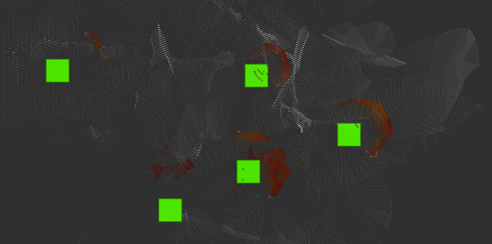
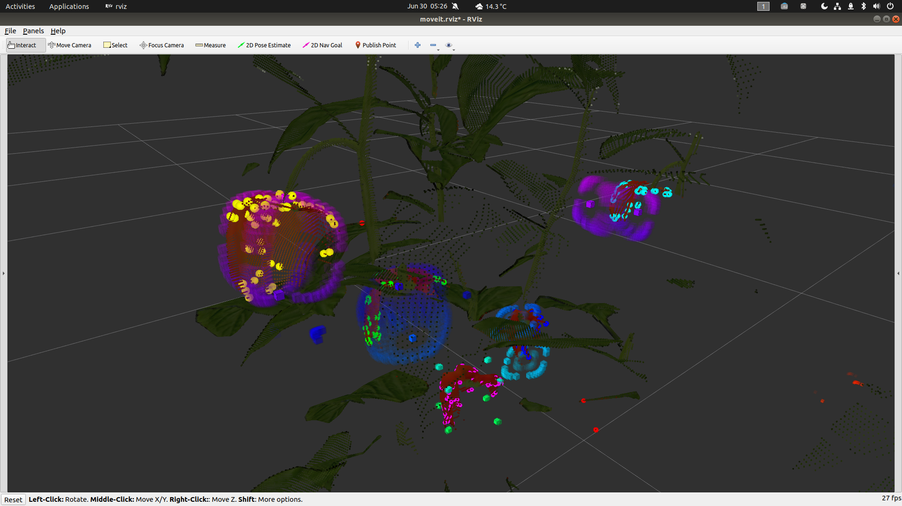

# capsicum_superellipsoid_detector

[toc]


## Compile & Run

```bash
# todo: ceres-solver dependency

$ cd catkin_ws/
$ rosdep install --from-paths src --ignore-src -r
$ catkin build --cmake-args -DCMAKE_BUILD_TYPE=Release

$ source catkin_ws/devel/setup.bash
$ roslaunch capsicum_superellipsoid_detector start.launch
```


## Meetings

### 29-July 2021

- Improved mass center prediction using with `bias towards a reference point regularization`. Means of clusters is used for reference points. See the images below for example results. (Note: TopDownOrtho is used in RViz)

**No regularization:** (Better predictions are drawn on the image)


**Bias towards a reference point regularization: ($\lambda = 2.5$**)



- I have analyzed `ceres-solver` and found these:
  - `ceres-solver` gives user options to calculate derivatives with analytical, numerical, or automatic differentiation. 
    - **Analytical differentiation** takes a lot of time on paper and we may need Mathematica etc. programs to find it effectively. 
    - **Numerical differentiation** uses forward, backward or central differentiation methods and takes more time compared to analytical method. But makes it possible to use external libraries inside the cost function.
    - And lastly, **automatic differentiation** generates the computation graph using operator overloading. Iterations computed faster and converges faster compared to other methods. The drawback is it may not be possible to use external libraries inside the cost function. This functionality, drawbacks and the way of thinking is similar to (or maybe same as) `PyTorch` library.
  - There is no direct answer if `scipy.optimize` uses numerical differentiation by default or not, but it seems like it is.
  - `ceres-solver` provides functions for angle-axis, quaternion and matrix rotations: http://ceres-solver.org/nnls_modeling.html#rotation-h
  - `ceres-solver` has many built-in differentiable operators (see: https://github.com/ceres-solver/ceres-solver/blob/master/include/ceres/jet.h) and combines **Eigen** vectors/matrices and its operations.
  - For the real tests, if there are outlier points because of the depth camera it would be possible to make the algorithm robust using a loss function. See: http://ceres-solver.org/nnls_modeling.html?highlight=loss%20function#_CPPv4N5ceres12LossFunctionE


### 22-July 2021

(skipped)


### 15-July-2021

- Surface normal extraction and predicting mass center using Least Squares Intersectıon of Lines is working, results look promising.
- Code is implemented in C++ mainly, prototype can be found in `notebooks/intersection_of_lines.ipynb`

ToDo:

- Seperated ROI pointclouds will be mapped with a higher precision Octomap and the algorithm will be tested on it.
- Evaluation is needed. Firstly try with default ground truths, after getting better results increase the resolution. If the orientation of the pepper is needed figure out a way.
- Implement superellipsoid optimizer using a non-linear least-squares library (e.g. ceres-solver, Eigen)

See:

- https://silo.tips/download/least-squares-intersection-of-lines
- http://ceres-solver.org/

Screenshots:


### 8-July-2021

(may not be complete because this documentation is started on 15 July)

- Superellipsoid optimization is implemented in Python. Prototype can be found in ` notebooks/detector.ipynb`

ToDo:

- Optimization gets stuck in local solutions (can be seen in the screenshot, the pepper on the upper right). Needs a prediction of the center for peppers.
- Use raw pointcloud from sensor.

Screenshots:


