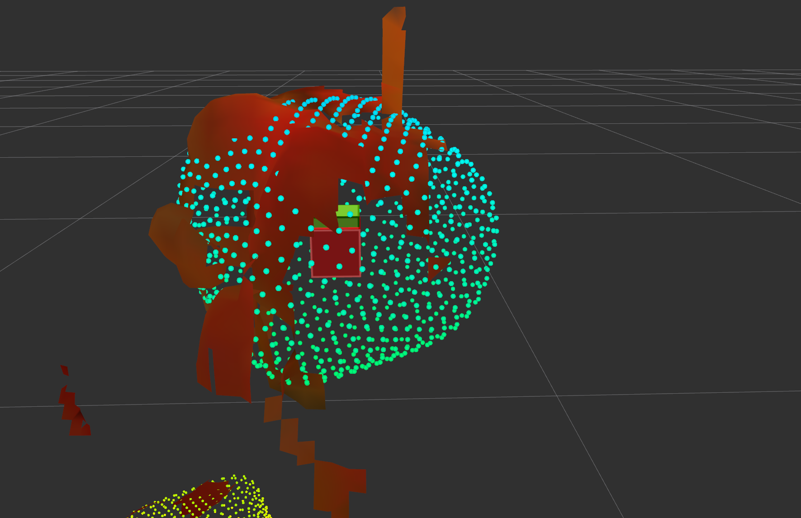
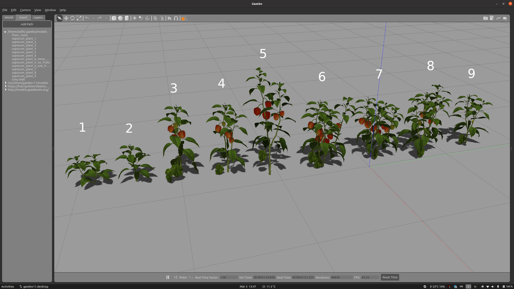
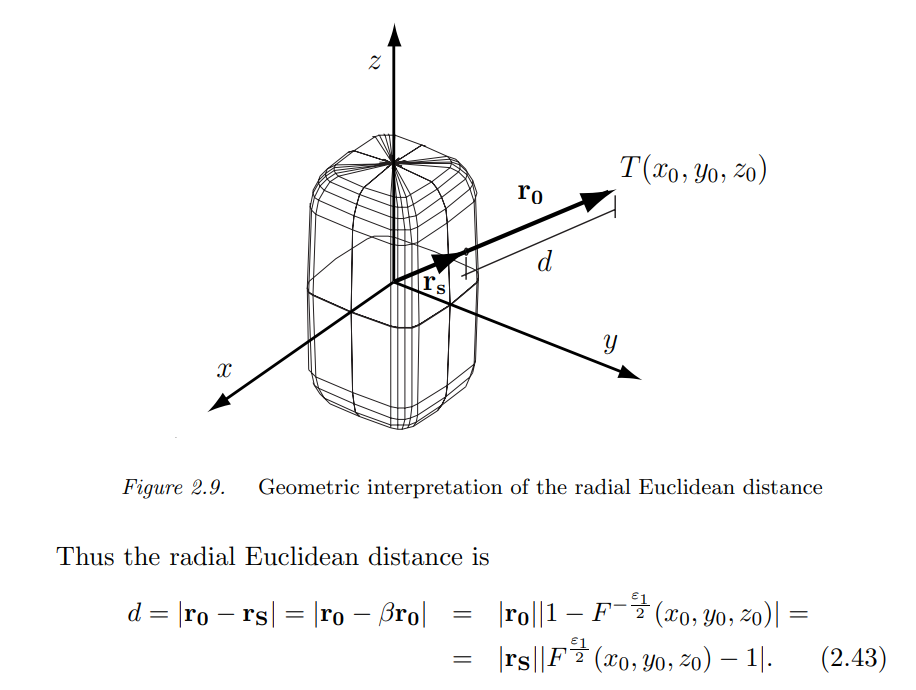
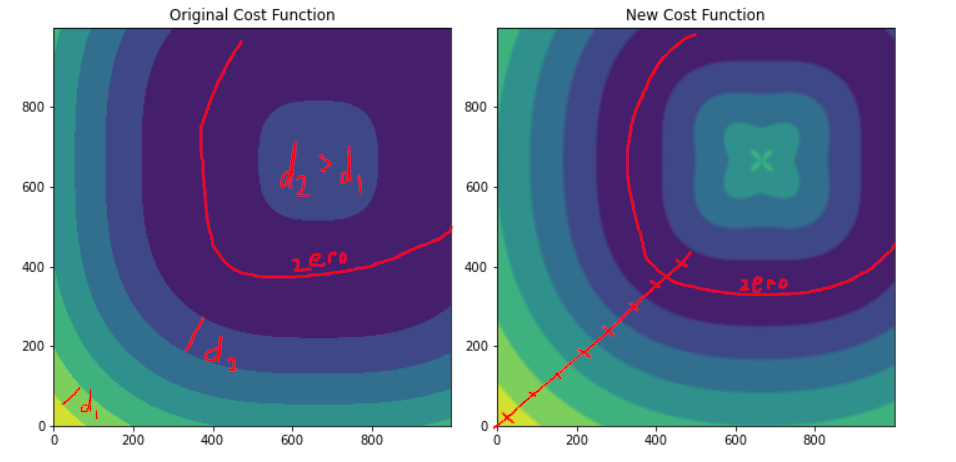
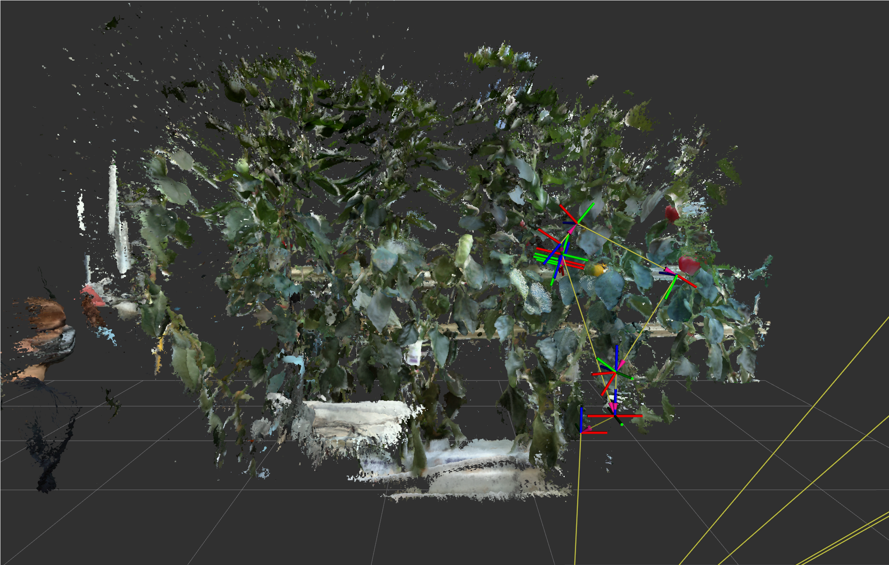
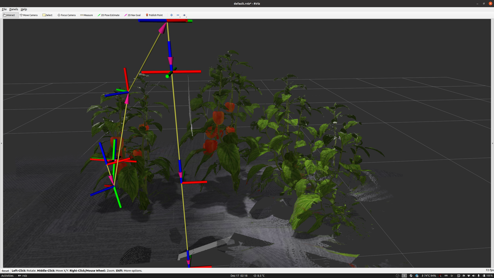
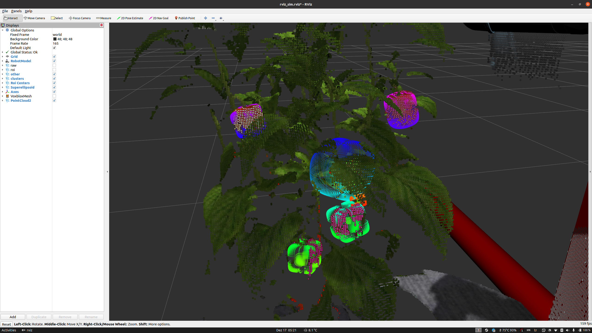
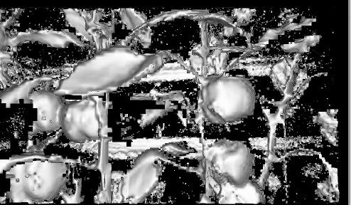
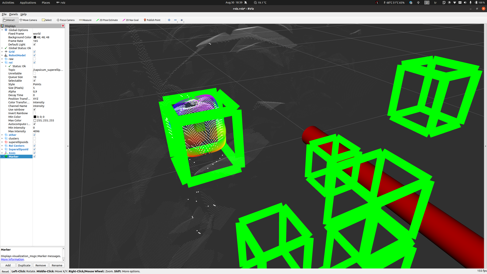
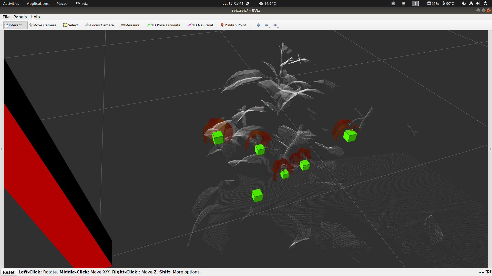

Table of Contents
=================

   * [Weekly Meeting Notes](#weekly-meeting-notes)
      * [12-Apr-2022](#12-apr-2022)
      * [22-Mar-2022](#22-mar-2022)
      * [09-Mar-2022](#09-mar-2022)
      * [02-Mar-2022](#02-mar-2022)
      * [22-Feb-2022](#22-feb-2022)
      * [11-Jan-2022](#11-jan-2022)
      * [17-Dec-2021](#17-dec-2021)
      * [02-Nov-2021](#02-nov-2021)
      * [26-Oct-2021](#26-oct-2021)
      * [18-Oct-2021](#18-oct-2021)
      * [23-Sep-2021 (Postponed to 24 Sept)](#23-sep-2021-postponed-to-24-sept)
      * [16-Sep-2021](#16-sep-2021)
      * [9-Sep-2021 (Postponed to 10 Sept)](#9-sep-2021-postponed-to-10-sept)
      * [2-Sep-2021](#2-sep-2021)
      * [26-Aug-2021](#26-aug-2021)
      * [19-Aug-2021](#19-aug-2021)
      * [12-Aug-2021](#12-aug-2021)
      * [05-Aug-2021](#05-aug-2021)
      * [29-July 2021](#29-july-2021)
      * [22-July 2021](#22-july-2021)
      * [15-July-2021](#15-july-2021)
      * [08-July-2021](#08-july-2021)
   * [Backup Forks](#backup-forks)
   * [Related Publications](#related-publications)


## Weekly Meeting Notes

**Note:** Some meeting notes are missing. Some meetings are canceled because of exams, collecting data on-site, implementations needs more than a week, etc. 

### 12-Apr-2022



To-Do list before closing the project:

- [x] add some images to the README

- [x] missing parts of the fruit:
  - I have added `superellipsoid_fibonacci_projection_sampling.ipynb` and found that projection fibonacci sphere onto a superellipsoid is **a pretty good solution** (image can be found above). I will combine this idea with `find_missing_part_of_spherical_data.ipynb` for extracting missing parts of the scanned fruits.

- [x] add an example bag file (with a single pointcloud)

- [x] add ros parameters (needs to be implemented first)

- [x] what to do with experimental clustering? it didn't work well... I will probably delete it.

- [x] fix the problem with simulator launch file. add this to `start_sim.launch` or implement this in Python or C++? I will probably add it to the launch files because this project doesn't aim segmenting depth camera data.

  - ```xml
    <node pkg="pointcloud_roi" type="filter_red_clusters_node" name="detect_roi">
        <remap from="~input" to="/camera/depth/points" />
        <remap from="~map_frame" to="/roi_viewpoint_planner/map_frame" />´
    </node>
    ```

- [x] clean git history from pdf and ipynb files. publishing the project in a public repository with research PDF's and old ipynb files with embedded videos in history is a not a good idea. (see: bfg-repo-cleaner)

### 22-Mar-2022

- Using curvature signs for normals direction correction didn't work well.
- I think accessing mesh inside of voxblox needs some workaround. I think the mesh can be exported as PointCloud2 with XYZRGBNormal. https://pointclouds.org/documentation/structpcl_1_1_point_x_y_z_r_g_b_normal.html
- Instead of computing normals twice, using `pcl::flipNormalTowardsViewpoint`. Example code:

```c++
new_superellipsoid->estimateNormals(0.015);
new_superellipsoid->estimateClusterCenter(2.5);
new_superellipsoid->flipNormalsTowardsClusterCenter();
```


### 09-Mar-2022

- Capsicum plant model cleaning notes:
  - All files are uploaded to Sciebo.
  - I have processed all plant models from `capsicum_plant_1` to `capsicum_plant_9`
  - Shell modifier is only applied on leaves and flowers.
  - Gazebo models include both DAE files (all-in-one and fruit only models) if there is at least one fruit with these naming conventions: `VG07_X_clean.dae` ,` VG07_X_fruitonly.dae`
  - For all exported DAE files related 3DS models are also available.



- Merged `templated_superellipsoid`. Thanks to Tobias!
- Created a new repository `superellipsoid_msgs` here: https://gitlab.igg.uni-bonn.de/hrl_students/salih-marangoz-hiwi/superellipsoid_msgs
- Added a missing published topic in `ROS Topics, Transforms, and Services` in README.
- Now Superellipsoid class can be initialized with superellipsoid_msgs::Superellipsoid, so sampleSurface, sampleVolume, etc. methods can be used (except the ones related to pointcloud processing)
- The detector node now published `~superellipsoids` topic with the ROS message type `superellipsoid_msgs::SuperellipsoidArray` which includes Superellipsoid implicit parameters (a,b,c,e1,e2), translation/rotation (tx,ty,tz,roll,pitch,yaw), and volume (in cubic meter). Example rostopic echo output: (note: stamps are zero because of `simulate_depth_noise.py` script I think)

```
---
header: 
  seq: 174
  stamp: 
    secs: 0
    nsecs:         0
  frame_id: "world"
superellipsoids: 
  - 
    header: 
      seq: 0
      stamp: 
        secs: 0
        nsecs:         0
      frame_id: "world"
    a: 0.07507354110713724
    b: 0.044208343286729436
    c: 0.07719025356094733
    e1: 0.3
    e2: 0.7963811001135296
    tx: 0.08293536181492861
    ty: 0.5913954813711576
    tz: 0.43861440435466015
    roll: 14.158259798464618
    pitch: -12.50883566765269
    yaw: 74.86105461708858
    volume: 0.0016399004591913589
  - 
    header: 
      seq: 0
...
```

- Transformation for `sampleSurface` and `sampleVolume` is optional now.

### 02-Mar-2022

- I have cleaned and exported `capsicum_plant_4` . It can be found in sciebo `salih_shared_files` folder. I have tested it with Gazebo and Rviz, everything seems ok.
- For the all steps I have prepared a youtube playlist: https://www.youtube.com/playlist?list=PLqiYY_Ff0Mui6EriaXwRA3RTmOL6kai09 (I have also uploaded them to sciebo but youtube side is better with descriptions).


### 22-Feb-2022

- Updated readme: 
  - Added topics, services, transforms information.
  - Corrected the installation instruction.
  - Removed custom PCL installation with GPU support and perception_pcl package since we don't need it anymore.
- Added a script (`trigger_voxblox.py`) to publish voxblox pointcloud in an interval.
- There was a problem with predicting centers with normals sometimes. I think analytical solution sometimes doesn't work well. In this cases, cluster mean is used as the prediction.
- **I think I found something good**. I have tried another optimization cost. Here: https://cse.buffalo.edu/~jryde/cse673/files/superquadrics.pdf in the `DISTANCE BETWEEN A POINT AND A SUPERELLIPSOID` section. In the formula $r_0$ is the distance from superellipsoid center and the point, $F$ is the output of superellipsoid equation. So as the paper says, $d = |r_0| * |1-F^{\frac{e_1}{2}}(x_0, y_0, z_0)|$. Ceres solver uses $d$ as residual. This method looks like fits better compared to the old method.






- I have also disabled some priors in the optimization to analyze performance of the new cost function. This may result weird outputs for fruits not scanned enough. Since current priors affecting the optimization in a bad way I am thinking about it.


### 11-Jan-2022

- see `launch/start_all.launch` for the file I am using currently.


### 17-Dec-2021







- SUMMARY: I got good results with Voxblox. It worked perfectly with Gazebo and produced very good results on real world data. 
- **`Backup Forks`** section is added.

- Voxblox is the best solution to the mapping problem for now. Features/Pros:

  - Project is still alive and getting updates.
  - Full ROS compatible.
  - Uses CPU & RAM instead of GPU. Slower computation but chunk switchings are much more faster.
  - Includes ICP for better mapping. Pose corrections can be accumulated or not depending on optional parameters.
  - Supports color mode.
  - Publishes mesh by default. Surface pointcloud (computed via reconstruction) can be published via a service.
  - TSDF can be published via a service.
  - Mapping depth data to TSDF is very good. I was having problems with PCL Kinfu in this category.

  

- `StatisticalOutlierRemoval` is able to remove most of the shadow points. Set $$mean_k > 15$$ for a good filtering (but increasing this value hurts the performance a lot).

  - Alternatively **`pcl::ShadowPoints`**  can be used but there is no ready to use ROS Node. But this method needs surface normal estimation (using Kd-Tree) so if **k** values are same with the statistical outlier filter then computation time would be very similar.
  - Here is the roslaunch section:

```xml
<node pkg="nodelet" type="nodelet" name="statistical_filter" output="screen" args="standalone pcl/StatisticalOutlierRemoval">
    <remap from="~input" to="camera/depth_registered/points"/>
    <remap from="~output" to="camera/depth_registered/points_filtered"/>
    <param name="mean_k" value="20"/>
    <param name="stddev" value="0.01"/>
    <param name="negative" value="false"/>
</node>
```

- Before finding **Voxblox** I have tried these projects (mostly in order and including all past experiments):

  - https://github.com/RMonica/ros_kinfu
    - Works good at the first sight with ROS but has many problem including TF and message syncronization. Too optimistic about the timing.
    - The code is not backwards compatible with the PCL kinfu.
    - Highly modified so things are different than PCL kinfu docs.
  - https://github.com/andyzeng/tsdf-fusion
    - Replace utils.hpp:40 with `cv::Mat depth_mat = cv::imread(filename, cv::IMREAD_UNCHANGED);` and modify compile.sh:11 from `opencv` to `opencv4`
    - Has python implementation: https://github.com/andyzeng/tsdf-fusion-python
    - No ROS.
    - Last updated 4 years ago. 
  - http://wiki.ros.org/rtabmap_ros
    - Not good for mapping small objects. TSDF methods are better for this kind of agricultural projects.
  - https://github.com/mp3guy/ElasticFusion
    - Says; "The system relies on an extremely fast and tight coupling between the mapping and tracking on the GPU, which I don't believe ROS supports natively in terms of message passing."
  - https://github.com/mp3guy/Kintinuous
    - Says; "If you have ROS installed you're likely to run into some truly horrible build issues."

  - https://gitlab.igg.uni-bonn.de/hrl_students/salih-marangoz-hiwi/kinfu_ls_ros
    - Copied kinfu_ros from PCL 1.10.1 then modified.
    - ICP is unstable.
    - Switching chunks takes a lot of time. Bigger chunks takes more time, small chunks increase the frequency of switching. Difficult to bear with realtime operation.
    - TSDF and output pointcloud have alignment problems. Also input depth is being processed incorrectly. But I was unable to find the problem in the both cases. Also camera focal points, etc. Nightmare.
  - https://github.com/Nerei/kinfu_remake
    - Remake of PCL Kinfu.
    - Code is independent from PCL.
    - I had some problems while implementing ROS in it and got stuck. Didn't waste too much time.
  - https://github.com/salihmarangoz/DirectionalTSDF (fork)
    - Solved compilation errors. Ready to run. See commits for more.
    - Run looks good but the implementation is too complex. Implementing ROS would be very difficult and time consuming.

- Haven't tried these ones. Only `yak_ros` was promising:
  - https://github.com/ros-industrial/yak_ros
  - https://github.com/tum-vision/dvo_slam (8 years old project)
  - https://github.com/tum-vision/fastfusion (8 years old project)
  - https://github.com/personalrobotics/kinfu_ros (very similar to https://github.com/Nerei/kinfu_remake)


### 02-Nov-2021

- Opened a new repository: https://gitlab.igg.uni-bonn.de/hrl_students/salih-marangoz-hiwi/kinfu_ls_ros
  - Checked PCL and RMonica implementations. **Selected PCL implementation as a base.** RMonica says; *"As of 2018-03-12, the integrated source code diverged significantly from original KinFu, due to many off-by-one errors which were discovered and fixed in the rolling buffer code. The code is not backward compatible with original KinFu."*. Also the RMonica ROS implementation has many synchronization problems on ROS messages. So, I started analyzing example code in the PCL (`pcl-1.10.1`) located here: https://github.com/PointCloudLibrary/pcl/blob/pcl-1.10.1/gpu/kinfu_large_scale/tools/kinfuLS_app.cpp Unfortunately there is no documentation and also every kinfu implementation uses their modified version of kinfu package so it is difficult, so implementation take a bit more time.


### 26-Oct-2021

I got stuck and decided to read papers instead of analyzing codes.

- Read a survey and a thesis (took my most of the time):
  - 3D Scanning Using RGBD Imaging Devices: A Survey:  [hitomi2015.pdf](papers/hitomi2015.pdf) 
  - High-†Quality 3D Reconstruction from Low-Cost RGB-D Sensors:  [1516463.pdf](papers/1516463.pdf)  (mostly for better texture and surface estimation)
  - case study: implementing a 3D scanner with PCL:  [PirovanoMichele-VisualReconstructionReport.pdf](papers/PirovanoMichele-VisualReconstructionReport.pdf) 

- Main idea is:

TSDF (Truncated Signed Distance Fields) is used for the mapping. 


While negative values indicates inside the object, positive values indicate outside of the object. Zero values represent the surface. Assuming that two depth images are aligned; base TSDF is built using the first image, and the next TSDF is built using the second image. The candidate TSDF is computed via using moving average on base TSDF with feeding next TSDF's. The surface then can be computed via marching cubes algorithm or Poisson reconstruction algorithm. It is also possible to predict depth image via raycasting over TSDF volume.

Also Octree implementation of TSDF also present on Github: https://github.com/saimanoj18/TSDFOctree (including texture information). Can be useful if it is not possible to use GPU. **But haven't tried it yet.** Videos from another projects with a similar ideas: https://www.youtube.com/watch?v=XlnO3GBNPvc and https://www.youtube.com/watch?v=sXEzLGJozQQ

According to `PirovanoMichele` **Kinfu** doesn't use RGB values for TSDF construction or edge-preserving. If better resolution is needed better algorithms are needed. For now it should be better to try `andyzeng/tsdf-fusion` package first. 

- Tried some implementations:
  - https://github.com/andyzeng/tsdf-fusion (can be used for combining different depth images)
    - Replace utils.hpp:40 with `cv::Mat depth_mat = cv::imread(filename, cv::IMREAD_UNCHANGED);`
    - Modify compile.sh:11 from `opencv` to `opencv4`
  - https://github.com/andyzeng/tsdf-fusion-python (works without any problems.)
- Also I am planning to try these, looks like a better implementation of Kinfu:
  - https://github.com/ros-industrial/yak_ros (yak -> yet another kinfu)
- Extra: `clear_params` launch parameter can be useful sometimes: http://wiki.ros.org/roslaunch/XML/node


### 18-Oct-2021

- I have tested more with `kinfu_ros` but this method loses tracking when robot arm moves a bit faster or gets closer to leaves. I think using this method with discontinuous rgbd sampling (sampling then moving robot arm then sampling again then moving robot arm...) may not work well.

- I am testing different methods and compare them. Not finished yet. Currently `rtabmap_ros` looks promising. But I have several questions:
  - Do we need a full-SLAM? Or odometry from robot arm would be enough? Or fusing encoder information and visual odometry together and mapping?
  - Directly mapping RGBD can be problematic. But improving depth quality with `Fast Generation of High Fidelity RGB-D Images by Deep-Learning with Adaptive Convolution` is also possible. More information down below.
  - Can we obtain good measurements from robot arm for mapping? What about timing and accuracy of 2D SLAM?

| Method                                                   | ROS?                                                        | Video                                               | Texture Mapping? | Try Order |
| -------------------------------------------------------- | ----------------------------------------------------------- | --------------------------------------------------- | ---------------- | --------- |
| [fastfusion](https://github.com/tum-vision/fastfusion)   | [fastfusion_ros](https://github.com/karrerm/fastfusion_ros) | [here](https://www.youtube.com/watch?v=7s9JePSln-M) | Yes              | 3.        |
| [dvo_slam](https://github.com/tum-vision/dvo_slam)       | Yes.                                                        | [here](https://www.youtube.com/watch?v=jNbYcw_dmcQ) | Yes              | 2.        |
| [ElasticFusion](https://github.com/mp3guy/ElasticFusion) | [elastic_bridge](https://github.com/RMonica/elastic_bridge) | [here](https://www.youtube.com/watch?v=XySrhZpODYs) | Yes              | 4.        |
| [Kintinuous](https://github.com/mp3guy/Kintinuous)       | No.                                                         | [here](https://www.youtube.com/watch?v=mqp3bWqxDsc) | Yes              | 5.        |
| [rtabmap_ros](http://wiki.ros.org/rtabmap_ros)           | Yes.                                                        | [here](https://www.youtube.com/watch?v=xbKVhZQFKgA) | Yes              | 1.        |

- Also, I found this which can be useful for filtering robot arm from rgbd sensor: http://wiki.ros.org/rgbd_self_filter

- Also; Fast Generation of High Fidelity RGB-D Images by Deep-Learning with Adaptive Convolution: [paper](https://arxiv.org/pdf/2002.05067.pdf) and [code](https://github.com/chuhuaxian/HF-RGBD). This work reduces ghosting and increases depth quality. I think this can be used for super-resolution mapping of capsicums.

- Also found a similar work: https://www.mdpi.com/1424-8220/19/2/428/htm
- For mapping of a fruit: https://www.preprints.org/manuscript/202105.0468/download/final_file But this method needs focusing a single object and moving around it. 


### 23-Sep-2021 (Postponed to 24 Sept)

- Need to compile PCL with CUDA configuration for using kinfu. But, PCL 1.10.0 has a [issue](https://github.com/PointCloudLibrary/pcl/issues/3728) compiling with CUDA so I have tried with 1.10.1 as mentioned, no issues so far. I have updated PCL compile instructions in this Readme.
- I have tried some implementations from Github;
  - https://github.com/personalrobotics/kinfu_ros (coded for sm20, not compatible)
  - https://github.com/Nerei/kinfu_remake (too old)
  - `$ svn checkout http://fsstud.is.uni-due.de/svn/ros/is/kinfu` (RMonica version is better. Many modifications applied to make it work but the results are bad)
  - https://github.com/RMonica/ros_kinfu (works!) (Tested on `2020-07-15-16-22-45.bag`)
    - 
    - RMonika can use TF hints for the ICP. This is not included in the PCL version. This may be useful with the robotic arm. We can directly use tf data for mapping or give this hint to ICP for better initialization and estimate difference between map and kinfu frames (like /map and /odom). 
- Some links:
  - Concept behind Kinfu Large Scale: https://www.youtube.com/watch?v=Ktc_NuJ2oIk
  - https://pcl.readthedocs.io/projects/tutorials/en/latest/using_kinfu_large_scale.html
    - https://answers.ros.org/question/287835/kinfu-for-3d-slam-and-navigation/
    - https://answers.ros.org/question/142461/pcl-kinfu-in-ros-hydro/

- **QUESTION:** Should I make a kinfu_ros package while getting hints from RMonica implementation? Or should I go with RTABMAP or other 3d mapping algorithms? Do we have a better implementation in the group?
- **QUESTION:** Kinect Fusion algorithm looks patented: https://patents.google.com/patent/US9563954B2/en Should I continue?
- **IDEA:** It looks possible to track textures and render an augmented image from the camera viewpoint. Maybe we can feed it to the MaskRCNN model. But I haven't seen an already working implementation. Regarding code lines are commented out. 


### 16-Sep-2021

- Timestamps in rosbags are weird. Depth data lags behind of RGB about 6 seconds. `queue_size` value can be decreased down to between 2 or 10 for the node which publishes `/camera/aligned_depth_to_color/*`. This would improve the overall quality of the datasets. Or aligning process can be done on-live.

- Experimented on `armbag__2020-09-11-14-38-57 (EXPLO_SAMPLING).bag`
- Octomap resolution with `0.002`. It was OK even though storing all free cells.
- QUESTION: Should I go with;
  - Reducing the sensor noise & shadowing effect with filters and continue mapping with octomap?
  - Trying Scene Registration algorithms (e.g. Kinect Fusion as mentioned in the [paper](papers/capsicum_pose_estimation_and_grasping.pdf))? If so, then I will need to register mask information as well. Possible implementation of Kinect Fusion: https://pointclouds.org/documentation/classpcl_1_1gpu_1_1kinfu_l_s_1_1_kinfu_tracker.html


### 9-Sep-2021 (Postponed to 10 Sept)

- Experimented `agrobot_mrcnn_ros` with `BONN_SweetPepper_Protected_2019_all_combined_best_validation_loss_epoch_00100.pth`.  Using some rosbags.
  - PROBLEM: `armbag__2020-09-11-13-48-07 (AUTO_SAMPLING).bag` and `armbag__2020-09-11-14-38-57 (EXPLO_SAMPLING).bag` Model is not able to detect close peppers. On the other hand, depth sensor is not able to detect far away peppers. Some peppers can be detected while the robotic arm moving fast. Time sync may improve the results but I haven't tried yet.
  - `2020-07-15-16-22-45.bag` There is depth and rgb data, but arm never stops moving. I will use this dataset and try syncronizing via timestamps.
- Pull request: https://github.com/Eruvae/ur_with_cam_gazebo/pull/1
- Pull request: https://gitlab.igg.uni-bonn.de/phenorob/cp1/roi-viewpoint-planning/agrobot_mrcnn_ros/-/merge_requests/1
- PROBLEM:  There is a problem here. Feeding all images to DL model is not a good method. Firstly, RGB and Depth images should be synchronized, then RGB image should be processed via DL model, then achieved ROI and non-ROI RGBD data should be inserted into two different Octomaps. I can proceed with this initial thought but I have experienced many outliers with DL experiment. 
- PROBLEM: DL solutions should be scale-invarient as much as possible but the given model is not capable in this context. Also the current model detects mostly red peppers compared to others. 
- QUESTION: Mask values differ between 0 and 255, and they are not binary. Does this information means ROI probability for the corresponding pixel? Should I use this as ROI probability or occupancy probability?

```
header: 
  seq: 8
  stamp: 
    secs: 1594823011
    nsecs: 863930231
  frame_id: "camera_color_optical_frame"
detections: 
  - 
    class_name: "capsicum"
    score: 1.0
    box: 
      x1: 0
      y1: 283
      x2: 74
      y2: 424
    mask: 
      width: 74
      height: 141
      mask: [0, 0, 0, 0, 0, 0, 0, 0, 0, 0, 0, 0, 0, 0, 0, 0, 0, 0, 0, 0, 0, 0, 0, 0, 0, 0, 0, 0, 0, 0, 0, 0, 0, 0, 0, 0, 0, 0, 0, 127, 0, 0, 0, 0, 0, 0, 0, 3, 255, 255, 0, 0, 0, 0, 0, 1, 255, 255, 255, 255, 0, 0, 0, 0, 0, 255, 255, 255, 255, 224, 0, 0, 0, 0, 63, 255, 255, 255, 252, 0, 0, 0,
...
255, 0, 0, 0, 0, 127, 255, 255, 255, 255, 128, 0, 0, 0, 31, 255, 255, 255, 255, 128, 0, 0, 0, 7, 255, 255, 255, 255, 192, 0, 0, 0, 1, 255, 255, 255, 255, 224, 0, 0, 0, 0, 63, 255, 255, 255, 224, 0, 0, 0, 0, 7, 255, 255, 255, 192, 0, 0, 0, 0, 0, 255, 255, 255, 192, 0, 0, 0, 0, 0, 1, 255, 255, 192, 0, 0, 0, 0, 0, 0, 1, 255, 0, 0, 0, 0, 0, 0, 0]
```

- QUESTION: It looks possible to insert only occupied measurements. See: https://github.com/OctoMap/octomap/blob/devel/octomap/src/simple_example.cpp#L57 We should track free cells only in non-ROI octomap since ROI octomap will be highly accurate it may take a lot of space and slow down computations. How can I do it with `octomap_vpp` package? **RoiOcTree::insertRegionScan** function seems to be the interest point in this case. I need a short introduction/discussion before using this.
- QUESTION: Should I add RGB values to the ROI octomap?


### 2-Sep-2021

- Added rotation to optimization parameters. Also two experimental regularizers are used for obtaining better results for clusters including only a few points. **When there is enough points the algorithm works very well.**
- IDEA: Experimental regularizers are only for experimentation. So, the distance between the predicted centroid and superellipsoid center point can be used for scanning quality, maybe? 
  - Or centroid prediction using normals can be used for the scanning quality; The algorithm accumulates a matrix (like a covariance matrix), so maybe it can be used for computing the information about the scan quality.
- PROBLEM: Ground truth data looks shifted a few cm's. More precise ground truth data can be obtained via mapping the pointcloud in the simulation.
- TODO: I will install the DL package and implement its ROI prediction output to the package, and will try to get results for the real world.
- TODO: I need to accumulate roi and non-roi points into two different octomaps. ROI octomap doesn't need to include empty voxels!

|                                      |                                      |
| ------------------------------------ | ------------------------------------ |
|  |  |
|  |  |


### 26-Aug-2021

- Heap corruption problem is solved with compiling PCL and Ceres-Solver. https://github.com/PointCloudLibrary/pcl/issues/4904 helped me to find that the root of the problem is the alignment of Eigen variables.
- Fixed ceres-solver can't found while compiling in an empty workspace.
- Added debugging notes. Now debugging with AddressSanitizer can be enabled/disabled commenting one line in `CMakeLists.txt`


### 19-Aug-2021

- Tried AddressSanitizer indicating heap-buffer-overflow. Only outputting the variable where the problem occurred, but not accurate. Will try to narrow the problem space. 
- No progress, got stuck!


### 12-Aug-2021

- Improved ceres-solver based implementation, but there is an important heap corruption problem blockling the progress of the project.
- Tried Valgrind and GDB but no luck.


### 05-Aug-2021

- Initial part for the solver using Ceres-solver implemented. 


### 29-July 2021

- Improved mass center prediction using with `bias towards a reference point regularization`. Means of clusters is used for reference points. See the images below for example results. (Note: TopDownOrtho is used in RViz)

**No regularization:** (Better predictions are drawn on the image)


**Bias towards a reference point regularization: ($\lambda = 2.5$**)


- I have analyzed `ceres-solver` and found these:
  - `ceres-solver` gives user options to calculate derivatives with analytical, numerical, or automatic differentiation. 
    - **Analytical differentiation** takes a lot of time on paper and we may need Mathematica etc. programs to find it effectively. 
    - **Numerical differentiation** uses forward, backward or central differentiation methods and takes more time compared to analytical method. But makes it possible to use external libraries inside the cost function.
    - And lastly, **automatic differentiation** generates the computation graph using operator overloading. Iterations computed faster and converges faster compared to other methods. The drawback is it may not be possible to use external libraries inside the cost function. This functionality, drawbacks and the way of thinking is similar to (or maybe same as) `PyTorch` library.
  - There is no direct answer if `scipy.optimize` uses numerical differentiation by default or not, but it seems like it is.
  - `ceres-solver` provides functions for angle-axis, quaternion and matrix rotations: http://ceres-solver.org/nnls_modeling.html#rotation-h
  - `ceres-solver` has many built-in differentiable operators (see: https://github.com/ceres-solver/ceres-solver/blob/master/include/ceres/jet.h) and combines **Eigen** vectors/matrices and its operations.
  - For the real tests, if there are outlier points because of the depth camera it would be possible to make the algorithm robust using a loss function. See: http://ceres-solver.org/nnls_modeling.html?highlight=loss%20function#_CPPv4N5ceres12LossFunctionE


### 22-July 2021

(skipped. no contributions.)


### 15-July-2021

- Surface normal extraction and predicting mass center using Least Squares Intersectıon of Lines is working, results look promising.
- Code is implemented in C++ mainly, prototype can be found in `notebooks/intersection_of_lines.ipynb`

ToDo:

- Seperated ROI pointclouds will be mapped with a higher precision Octomap and the algorithm will be tested on it.
- Evaluation is needed. Firstly try with default ground truths, after getting better results increase the resolution. If the orientation of the pepper is needed figure out a way.
- Implement superellipsoid optimizer using a non-linear least-squares library (e.g. ceres-solver, Eigen)

See:

- https://silo.tips/download/least-squares-intersection-of-lines
- http://ceres-solver.org/

Screenshots:





### 08-July-2021

(may not be complete because this documentation is started on 15 July)

- Superellipsoid optimization is implemented in Python. Prototype can be found in ` notebooks/detector_prototype.ipynb`

ToDo:

- Optimization gets stuck in local solutions (can be seen in the screenshot, the pepper on the upper right). Needs a prediction of the center for peppers.
- Using raw pointcloud from sensor. Needs 3D mapping.

Screenshots:


## Backup Forks

In case of some projects disappear.

- https://github.com/salihmarangoz/voxblox
- https://github.com/salihmarangoz/perception_pcl (not needed for current version)
- https://github.com/salihmarangoz/OpenChisel (not needed for current version)
- https://github.com/salihmarangoz/DirectionalTSDF (not needed for current version)


## Related Publications

- Lehnert, Christopher, et al. "Sweet pepper pose detection and grasping for automated crop harvesting." *2016 IEEE international conference on robotics and automation (ICRA)*. IEEE, 2016. [PDF](https://eprints.qut.edu.au/95756/18/capsicum_pose_estimation_and_grasping.pdf)
- Hitomi, Eduardo E., Jorge VL Silva, and Guilherme Ruppert. "3D scanning using RGBD imaging devices: A survey." *Developments in Medical Image Processing and Computational Vision*. Springer, Cham, 2015. 379-395.
- Traa, Johannes. "Least-squares intersection of lines." *University of Illinois Urbana-Champaign (UIUC)* (2013). [PDF](https://silo.tips/download/least-squares-intersection-of-lines)
- Pirovano, Michele. "Kinfu–an open source implementation of Kinect Fusion+ case study: implementing a 3D scanner with PCL." *UniMi, Tech. Rep.* (2012). [PDF](https://ais-lab.di.unimi.it/Teaching/AdvancedIntelligentSystems/Old/IntelligentSystems_2014_2015/Documents/PirovanoMichele-VisualReconstructionReport.pdf)
- Pilu, Maurizio, and Robert B. Fisher. "Equal-distance sampling of superellipse models." (1995): 257-266. [PDF](https://www.researchgate.net/profile/Robert-Fisher-3/publication/2710500_Equal-Distance_Sampling_of_Superellipse_Models/links/0fcfd50f59aec76f5b000000/Equal-Distance-Sampling-of-Superellipse-Models.pdf)
- Ferreira, Paulo. "Sampling Superquadric Point Clouds with Normals." *arXiv preprint arXiv:1802.05176* (2018). [PDF](https://arxiv.org/pdf/1802.05176.pdf)
- Jaklič, Aleš, Aleš Leonardis, and Franc Solina. "Superquadrics and their geometric properties." *Segmentation and recovery of superquadrics*. Springer, Dordrecht, 2000. 13-39. [PDF](https://cse.buffalo.edu/~jryde/cse673/files/superquadrics.pdf)

